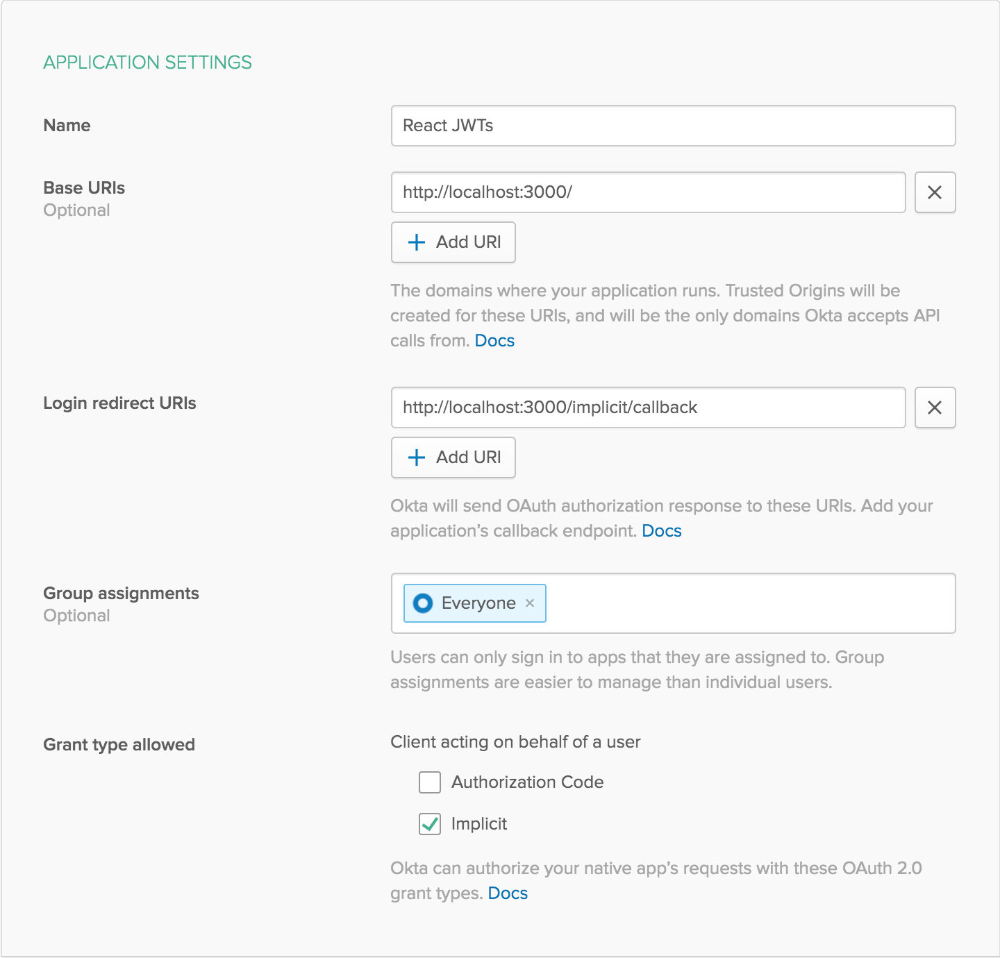
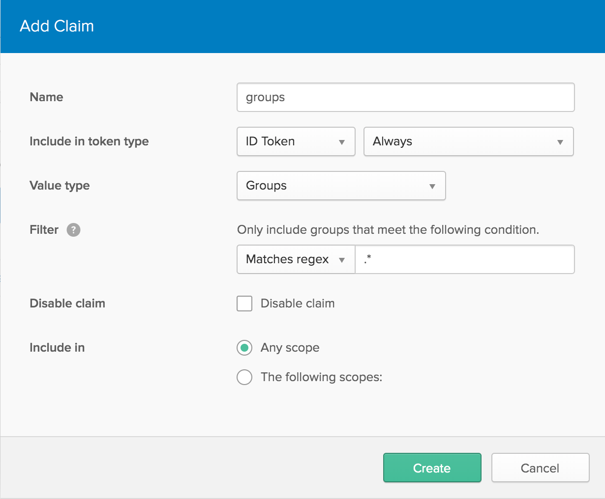
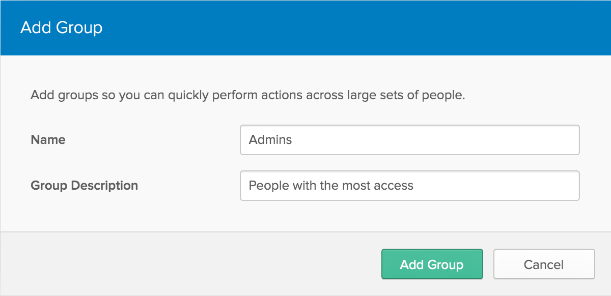

# Example App Using React and Okta

This example app shows how to create a simple search app using React and Okta for authentication.

This project was bootstrapped with [Create React App](https://github.com/facebookincubator/create-react-app).

**Prerequisites**: [Node.js](https://nodejs.org/en/) and [Yarn](https://yarnpkg.com/lang/en/).

## Getting Started

To install this example application, run the following commands:

```bash
git clone git@github.com:oktadeveloper/okta-react-jwt-example.git
cd okta-react-jwt-example
yarn
```

This will install a local copy of the project. You will need to set up some environment variables before the app will run properly.

To integrate Okta's Identity Platform for user authentication, you'll first need to:

* [Sign up for a free Okta Developer account](https://www.okta.com/developer/signup/)
* You will get a URL similar to `https://dev-123456.oktapreview.com`.
  * Save this URL for later
  * You will also use this URL to login to your Okta account

You will need to create an application in Okta:

* Log in to your Okta account, then navigate to **Applications** and click the **Add Application** button
* Select **Single-Page App** and click **Next**
* Give your application a name (e.g. "My React App")
* Change the **Base URI** to `http://localhost:3000/` and the **Login redirect URI** to `http://localhost:3000/implicit/callback`, then click **Done**
* Save your **Client ID** for later

Your Okta application should have settings similar to the following:



While you're still signed in to your Okta account:
  * Navigate to **API** -> **Authorization Servers**
  * Click on the `default` server, then go to the **Claims** tab
  * Click **Add Claim** and give it a name of `groups`
  * Change `Include in token type` to `ID Token`
  * For `Value type`, select `Groups`
  * Under `Filter`, change the `Starts with` dropdown to `Matches regex` and enter `.*` in the text field next to it
  * Click **Create** to save it.



Next, navigate to **Users** -> **Groups**. Click the **Add Group** button and create a new group called `Admins`, and give it a friendly description, then click **Add Group**.



Click on the new group you just created, then click **Add Members** and type your name into the search bar, then click the **Add** button next to your user. It will help for testing if you have another account that's not in the `Admins` group.

Now create a file called `.env.local` in the project root and add the following variables, replacing the values with your own from the previous steps.

**.env.local**
```bash
REACT_APP_OKTA_CLIENT_ID={yourClientId}
REACT_APP_OKTA_ORG_URL=https://{yourOktaOrgUrl}
```

Now you can run the React frontend with the following command:

```bash
yarn start
```

## Links

This example uses the [Okta React SDK](https://github.com/okta/okta-oidc-js/tree/master/packages/okta-react).

## Help

Please [raise an issue](https://github.com/oktadeveloper/okta-react-jwt-example/issues) if you find a problem with the example application, or visit our [Okta Developer Forums](https://devforum.okta.com/). You can also email [developers@okta.com](mailto:developers@okta.com) if would like to create a support ticket.

## License

Apache 2.0, see [LICENSE](LICENSE).
